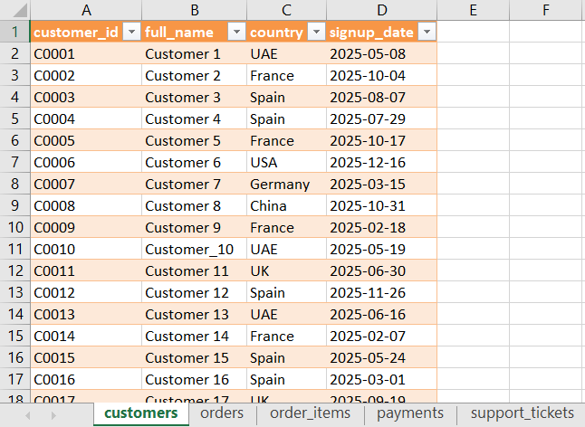
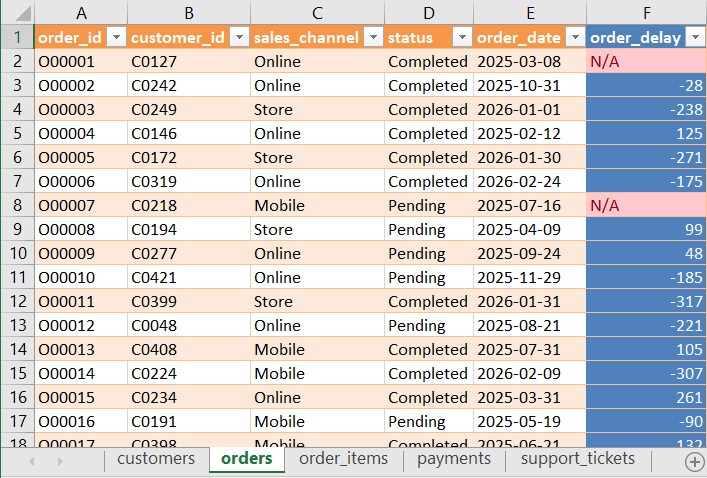
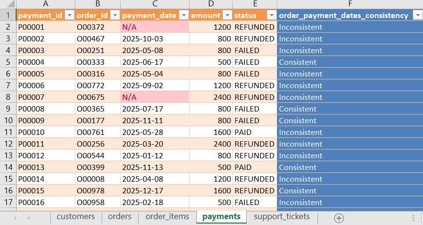
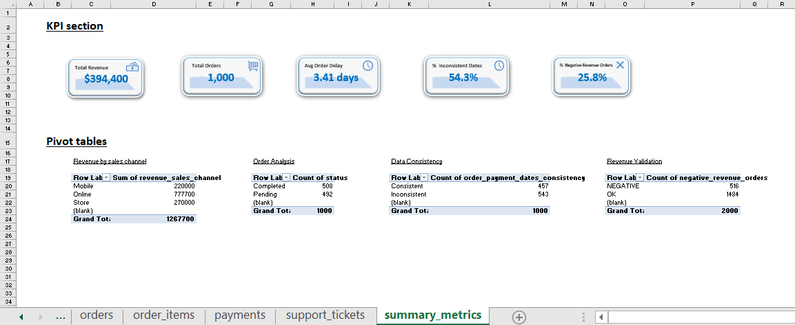

*The analysis indicates that the dataset is generally well-structured, with only minor data quality issues identified during the cleaning process. Duplicate records, missing values, and formatting inconsistencies were reviewed and addressed where necessary to improve overall data reliability.*

*From a performance perspective, revenue and order distribution appear relatively consistent across categories, suggesting stable operational activity. However, the presence of data inconsistencies, particularly in date sequencing and negative transaction values, highlights potential areas for improvement.*

*Overall, while the dataset supports general operational analysis, further investigation into these inconsistencies may help enhance both data quality and process reliability.*

---

**Project Name:** Customer Orders Data Cleaning & Transformation (Power Query)   
**Dataset Size / Rows:** customers (500), orders (1000), order\_items (2000), payments (1000), support\_tickets (1500)  
**Date Completed:** 25/04/2026

---

**WORKBOOK AND DATASHEETS STRUCTURE**

**1\. Datasheet Overview**

*The dataset contains transactional and operational data used to evaluate business performance, efficiency, and data quality across multiple dimensions.* 

Key columns include:

- **customer\_id**  
- **order\_id**  
- **order\_item\_id**  
- **payment\_id**  
- **ticket\_id**

**2\. Derived Metrics & Supporting Calculations**

*Additional helper sheets were used to support intermediate calculations and pivot table structures.*

Key columns include:

- **revenue**  
- **order\_delay**  
- **order\_payment\_dates\_consistency**  
- **negative\_revenue\_orders**

**3\. Analysis Sheets Structure**

*The dataset was organized into dedicated analysis sheets:*

- **customers**  
   → Original dataset containing customer-level information used to support transaction and behaviour analysis.  
- **orders**  
   → Original dataset containing order-level transactional data used as the foundation for sales and operational analysis.  
- **order\_items**  
   → Original dataset containing item-level sales details, including quantity and pricing, used for revenue calculations.  
- **payments**  
   → Original dataset containing payment transactions and status information used to evaluate financial performance and processing.  
- **support\_tickets**  
   → Original dataset containing customer support interactions used to assess service activity and operational issues.

*Additional sheets were created for analysis and data recording:* 

- **summary\_metrics**  
   → Aggregated dataset containing calculated KPIs and pivot table outputs used for performance and data quality analysis.

---

   **FORMULAS TABLE**

| Task | Formula |
| :---- | :---- |
| Order revenue | \=D2\*E2 |
| Order delay | \=Table7\_3\[@\[payment\_date\]\]-\[@\[order\_date\]\] |
| Order-payment dates consistency | \=IF(OR(\[@\[payment\_date\]\]="N/A"; Table3\_5\[@\[order\_date\]\]="N/A"); "Inconsistent"; IF(\[@\[payment\_date\]\]\>Table3\_5\[@\[order\_date\]\]; "Consistent"; "Inconsistent")) |
| Revenue of paid payments | \=IF(F2="PAID"; E2; "N/A") |
| Negative revenue orders | \=IF(F2\<0; "NEGATIVE"; "OK") |
| Revenue corresponding to sales channel | \=VLOOKUP(Table7\_3\[@\[order\_id\]\]; payments\!$B$2:$G$1001; 4; FALSE) |

---

**Analysis & Key Findings:**

**1\. Data Cleaning**  

Remove duplicate records: All tables were reviewed for duplicate records using Power Query. No duplicate entries were identified across any of the datasets.

This indicates that the data does not present integrity issues related to duplication, and records appear uniquely maintained across all tables.

Handle missing values appropriately: Missing values were identified and handled using Power Query. Null entries were replaced with “N/A” to maintain dataset completeness and ensure consistency during analysis.

A total of 104 missing values were found in the payments table and 438 in the support\_tickets table.

These findings indicate the presence of data completeness issues, which may reflect operational gaps or system limitations. Further investigation may be required to determine the underlying causes and improve data quality.

Standardize date formats: Date fields across all tables were standardized to a consistent Year-Month-Day (YMD) format using Power Query. This was necessary due to the presence of multiple date formats within the dataset.

Standardizing date formats ensures consistency, improves data readability, and prevents potential errors in time-based calculations and analysis.

Clean text fields (trim spaces, consistent casing): Text fields were standardized using Power Query by removing leading and trailing spaces (Trim) and applying consistent casing across categorical values. Depending on the column, transformations included capitalization of each word, conversion to uppercase, and correction of inconsistent entries.

Multiple inconsistencies in text formatting were identified and resolved, improving overall data consistency and ensuring reliable grouping and analysis. 

*Screenshot of customers sheet cleaned.*

**2\. Data Transformation (Power Query focus)**  

Split columns where needed (e.g., full names): This transformation was assessed to identify any compound fields suitable for splitting (e.g., full names or combined attributes). No applicable columns were present in the dataset, as fields were already atomic and structured individually. 

If required, this transformation would be performed in Power Query using the Split Column and By Delimiter function to separate values into distinct attributes for improved analysis.

Convert data types correctly: Data types were reviewed in Power Query to ensure consistency across all fields, including identifiers, numeric values, and dates. All columns were already correctly assigned appropriate data types, so no transformations were required.

Create calculated columns: 

 Revenue \= Quantity × Price: A Revenue column was created in the order\_items table by multiplying Quantity by Price.

The analysis revealed multiple negative revenue values, which were traced to negative entries in the Quantity field. This indicates potential data entry errors or inconsistencies in how transactions were recorded.

These discrepancies may impact financial reporting accuracy and require further investigation to determine whether they represent valid cases (e.g., returns) or data integrity issues.

 Order Delay \= Payment Date – Order Date: An Order Delay column was created in the orders table by calculating the difference between Payment Date and Order Date.

The analysis showed a majority of negative delay values, indicating that many payment dates were recorded as occurring before the corresponding order dates. This suggests significant inconsistencies in date recording or processing logic.

Such discrepancies may affect time-based analysis and operational insights, and warrant further investigation to identify underlying causes.

*Screenshot of orders sheet.*

**3\. Data Validation**  

Identify:

 Convert data types correctly: Data types were reviewed and validated within Power Query to ensure consistency across all fields, including identifiers, numeric values, and date columns.

All columns were already assigned appropriate data types, and no transformations were required. This confirms that the dataset was properly structured for accurate calculations and analysis.

 Inconsistent categorical values (status, channel): Categorical fields such as status and channel were reviewed to identify inconsistencies in value representation, including variations in casing and naming conventions. No discrepancies were identified, indicating that categorical values were consistently formatted across the dataset.

If inconsistencies were present, they would be addressed in Power Query using standardization techniques such as case formatting and the Replace Values function to correct specific entries. As no issues were found, no standardization transformations were required.

Ensure logical consistency: 

 Payment date ≥ Order date: Logical consistency between Payment Date and Order Date was evaluated by creating a validation column in the payments table using conditional logic. Records were classified as “Inconsistent” when the payment date occurred prior to the corresponding order date, and “Consistent” otherwise.

The analysis identified a significant number of inconsistent records, indicating potential issues in date recording or system processing logic. These discrepancies may impact time-based analysis and warrant further investigation to determine their underlying causes.

*Screenshot of payments sheet.*

**4\. Output**  

- Clean dataset ready for analysis  
- Load final table into Excel  
- (Optional) Create summary metrics or pivot table: 

A set of key performance indicators (KPIs) was developed to provide a high-level overview of both business performance and data quality. These included:

- **Total Revenue**: calculated from a derived final\_revenue column in the payments table, considering only successfully paid transactions.  
- **Total Orders**: representing overall transaction volume.  
- **Average Order Delay**: measuring the time difference between order and payment dates, calculated from a derived order\_delay column in orders table.  
- **% of Inconsistent Dates**: derived from a validation column (order\_payment\_dates\_consistency) and calculated using a pivot table.  
- **% of Negative Revenue Orders**: based on a derived negative\_revenue\_orders column in the order\_items table and summarized via pivot analysis.

In addition, multiple pivot tables were created to support detailed analysis:

- **Revenue by Sales Channel**: using a derived revenue\_sales\_channel field in the orders table.  
- **Order Analysis**: showing the count of orders by order status.  
- **Data Consistency**: summarizing counts of Consistent vs Inconsistent payment-date relationships.  
- **Revenue Validation**: analyzing the distribution of negative versus  valid (“OK”) revenue orders.

These metrics and pivot tables provide a structured view of operational performance while highlighting key data integrity issues identified during the analysis.

*Screenshot of summary\_metrics sheet.*

---

**Overall Conclusion**

This project demonstrates an end-to-end data cleaning, transformation, and validation workflow using Excel and Power Query. The dataset was systematically reviewed to ensure data quality, consistency, and readiness for analysis.

While the majority of the data was well-structured, several key issues were identified, including missing values, negative transaction quantities, and inconsistencies in date sequencing between orders and payments. These findings highlight potential gaps in data recording processes and operational workflows.

The creation of calculated fields, validation logic, and summary metrics enabled both performance analysis and data quality assessment. In particular, the identification of negative revenue values and inconsistent payment timelines provides meaningful insights into areas that may require further operational review.

Overall, the final dataset is structured and analysis-ready, supporting reliable reporting and decision-making. At the same time, the project emphasizes the importance of continuous data validation to maintain accuracy and improve business processes.
